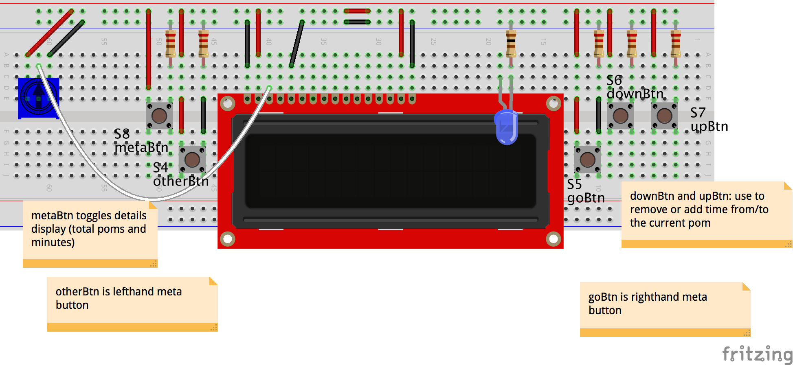

Scratching a little itch I have about simple Pomodoro timers. This code will run on:

* Arduino Uno R3 and similar Arduino boards (5V)
* Intel Edison + Arduino Breakout (3.3V)
* Tessel 2 (3.3V)
* Raspberry Pi 3 (3.3V)

Pomlet can time your [Pomodoro poms](https://en.wikipedia.org/wiki/Pomodoro_Technique). Think of it like a Pom-flavored egg timer. By default, it will alternate between work poms (25 minutes long) and break poms (5 minutes long). But you have control over that. You can swap the type of the next pom, and you can add or subtract time (in minute increments) any time you want, even when the pom is running. This breaks the core Pomodoro rules, but I find that tasks don't always neatly fit into 25 minutes and sometimes interruptions happen. Poms can be paused. A paused pom can be canceled.

Pressing the `metaBtn` will show a summary of total poms completed and total minutes pom-med so far (only "work" poms are counted in the running total). You can reset the Pomlet—kind of like a trip odometer in a car—and start over. The Pomlet will alert you when time's up in your current pom. That's pretty much it!

## LCD and Buttons Interface

The default (currently only) interface for Pomlet is a circuit containing an LCD display, five control buttons and an LED that will pulse when "time's up".

### What you'll Need

* 1 compatible board/platform
* 3.3V _or_ 5V basic 16x2 parallel LCD display (depending on your device's logic-level voltage)
* 5 pushbuttons
* 5 10kΩ resistors
* 1 standard LED, any color you like
* 1 100Ω (3.3V devices) or 220Ω (5v devices) resistor
* 1 10kΩ potentiometer
* One full-plus breadboard
* A whole grip of jumper wires

### The Circuit

Every Pomlet-running platform shares the same circuit, with two differences:

* Choose the right LCD for your platform: 3.3V or 5V. Arduinos are 5V; so far the other supported platforms are 3.3V. The pinouts are identical. It's fast to swap these out.
* You may want to use a 100Ω resistor for the LED on 3.3V devices. However, a 220Ω is fine, really.

#### Some Notes on the Circuit

The wiring diagram here shows the circuit without connections to a board, using a full-plus breadboard. It shows a 3.3V variant, with a 100Ω resistor for the LED.

The following can be inferred visually from the wiring diagram, but are detailed here in case it helps:

* Note especially some of the on-breadboard power wires.
* The power rails need to be connected midway down the length (power rails don't run the full length of most half-plus boards).
* Make sure there is power bridging the central notch for `otherBtn` and `goBtn` and _triple-check_ the orientation of those buttons.
* LCD should be connected to ground on pins 1, 5, 16 and VCC on 2 and 15.
* Output of the potentiometer runs into pin 3 of the LCD.

### Make it Go!

Follow board-specific hookup and software instructions for each `platform-`:

* [Arduino Uno R3 and similar Arduino boards (5V)](platform-arduino-uno)
* [Intel Edison + Arduino Breakout (3.3V)](platform-intel-edison)
* [Tessel 2 (3.3V)](platform-tessel-2)
* [Raspberry Pi 3 (3.3V)](platform-raspberry-pi-3)
