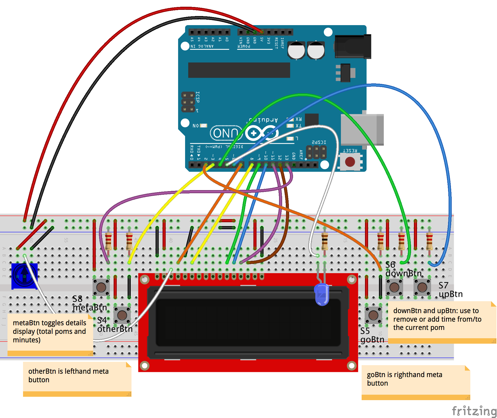

Scratching a little itch I have about simple Pomodoro timers. This code will run on:

* Arduino Uno R3 and similar Arduino boards
* Intel Edison + Arduino Breakout
* Tessel 2
* Raspberry Pi 3

### Wiring

You'll need:

* 3.3V _or_ 5V basic LCD display (depending on your device's logic-level voltage)
* 5 pushbuttons
* 5 10kΩ resistors
* 1 standard LED
* 1 100Ω (3.3V devices) or 220Ω (5v devices) resistor
* 1 10kΩ potentiometer
* A breadboard or two
* A whole grip of jumper wires

## Install and Use

1. Clone/fork/download/whatever repo
1. `npm install`
1. Continue with board-specific instructions below

## Board-Specific Instructions

_Note_: The current method of swapping out `require`'d `config` modules in `main.js` is hamfisted. It got this way because of the need to run the script in contexts that might not be able to take command-line args (e.g. `t2`) but I'll make it better when I get a chance.

### Arduino-Compatible (Uno-ish) Boards

You shouldn't have to make any adjustments to code unless you use different pins than are declared in `config.js` for your components.

`node main.js`

1. `npm install`
1. Plug components in (TODO: fritzing)
1. `node main.js`

### Tessel 2

_Note_: Make sure to use a 3.3V LCD

1. You'll need the `tessel-io` I/O plugin for Johnny-Five: `npm install tessel-io`
1. Edit `main.js` to use `config-tessel.js`
1. Make sure your components are plugged into the pins declared in `config-tessel.js`
1. `t2 run main.js`

### Edison + Arduino

_Note_: To run this on an Edison, I recommend that you clone this repo _to the Edison itself_ (fortunately the default Yocto Linux on Edison comes with the `git` and the `npm` that you need).

1. You'll need the `galileo-io` I/O plugin for Johnny-Five: `npm install galileo-io`
1. Edit `main.js` to use `config-edison.js`
1. Make sure your components are plugged into the pins declared in `config-edison.js`
1. `node main.js` (run this on the Edison)

### Raspberry Pi 3

Depending on your setup, you may not be plugging directly into the Raspberry Pi's GPIO on-board pins. The wiring diagram here is pretty nasty looking, but if you're using a SparkFun Pi Wedge, the connections are a little more sane. Make sure your connections, in the end, correspond with the pins in `config-pi-3.js`. The wiki for `raspi-io` has a pretty good [lookup table of all pinouts](https://github.com/nebrius/raspi-io/wiki/Pin-Information) if you get lost.

_Note_: I've not tested it, but I see no reason that this wouldn't work on Raspberry Pi 2, Model B or any of the other Raspberry Pis that have a compatible GPIO pinout.

1. You'll need the `raspi-io` I/O plugin for Johnny-Five: `npm install raspi-io`.
2. Edit `main.js` to use `config-pi-3.js`
3. Double- and triple-check pin numbers for components in `config-pi-3.js` and your circuit. Yes, I know. Pi pinouts are...brain-bending.
