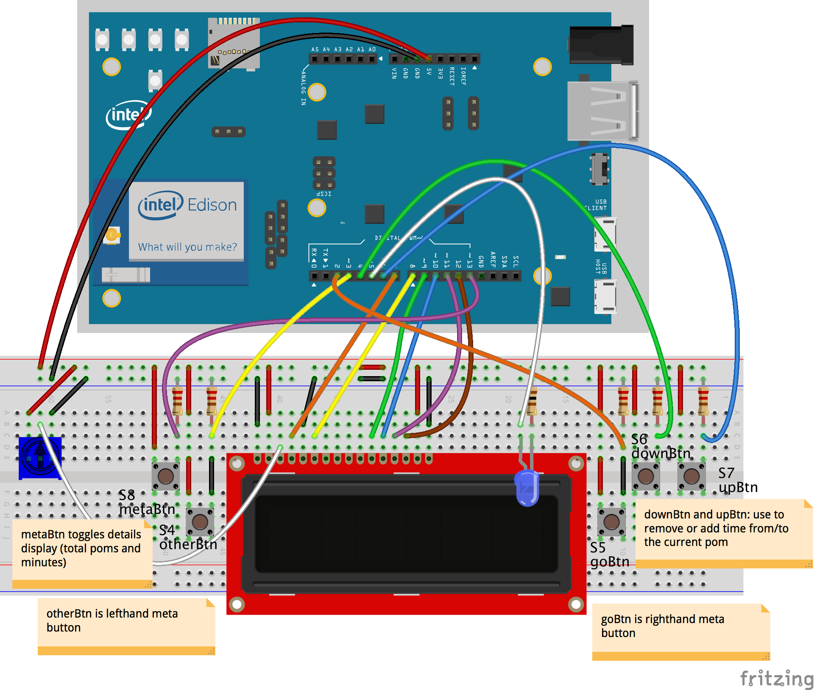

# Running Pomlet on Intel Edison + Arduino Breakout

First, build the circuit and connect it to the Edison.

Do all of the following things _on the Edison itself_ (not your computer):

1. clone repo
1. `npm install`
1. You'll also need the `galileo-io` Johnny-Five I/O Plugin
    `npm install galileo-io`
1. `node index.js`
