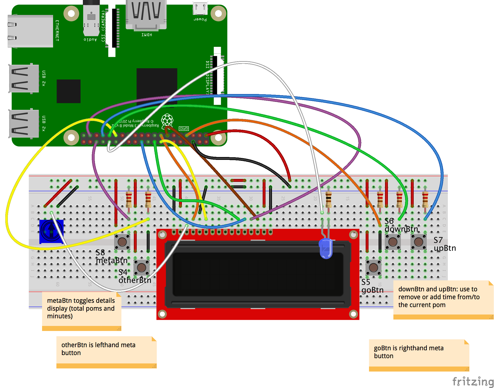

# Running Pomlet on a Raspberry Pi 3

First, build the circuit and connect it to the Pi:

Do the following _on the Pi_:

1. clone the repo
1. `npm install`
1. You'll need the `raspi-io` I/O plugin for Johnny-Five, also: `npm install raspi-io`.
1. Double- and triple-check pin numbers for components in `index.js` and your circuit. Yes, I know. Pi pinouts are...brain-bending.
1. `node index.js`

## Notes

Depending on your setup, you may not be plugging directly into the Raspberry Pi's GPIO on-board pins. The wiring diagram here is pretty nasty looking, but if you're using a SparkFun Pi Wedge, the connections are a little more sane. Make sure your connections, in the end, correspond with the pins in `config-pi-3.js`. The wiki for `raspi-io` has a pretty good [lookup table of all pinouts](https://github.com/nebrius/raspi-io/wiki/Pin-Information) if you get lost.

_Note_: I've not tested it, but I see no reason that this wouldn't work on Raspberry Pi 2, Model B or any of the other Raspberry Pis that have a compatible GPIO pinout.
