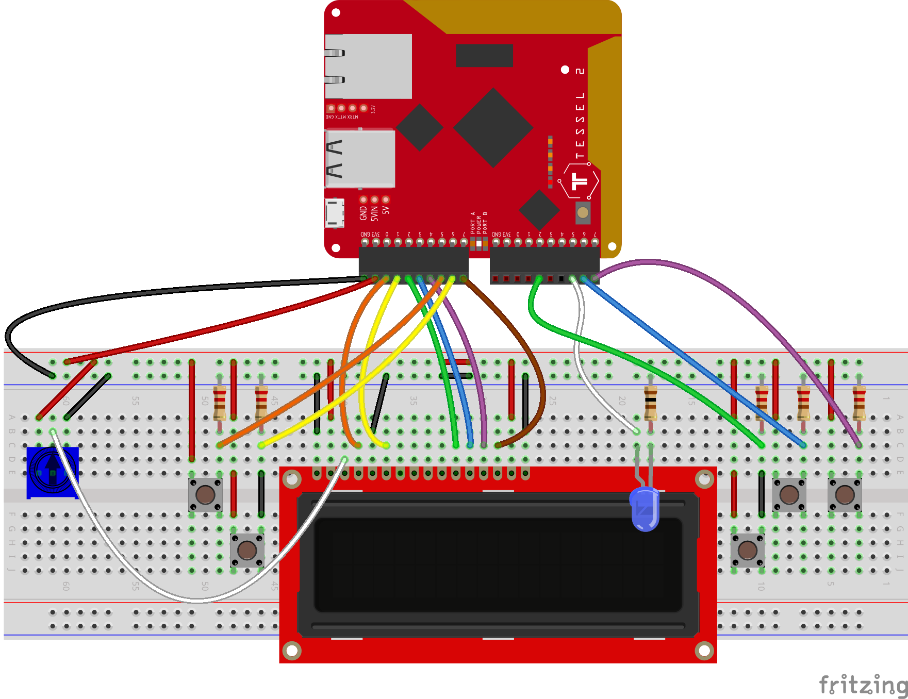

# Running Pomlet on a Tessel 2

## PreRequisites

You'll need a [provisioned Tessel 2](http://tessel.github.io/t2-start/) and the global `t2` CLI utility. If you don't already have it:

`npm install -g t2-cli`

## Build and Run Pomlet

First, build the circuit and connect it to the Tessel:

_Note_: Make sure to use a 3.3V LCD

Do the following things on your laptop/computing device:

1. clone this repo
1. You'll also need the `tessel-io` I/O plugin for Johnny-Five: `npm install tessel-io`
1. Make sure your components are plugged into the pins declared in `index.js`
1. `t2 run index.js`
